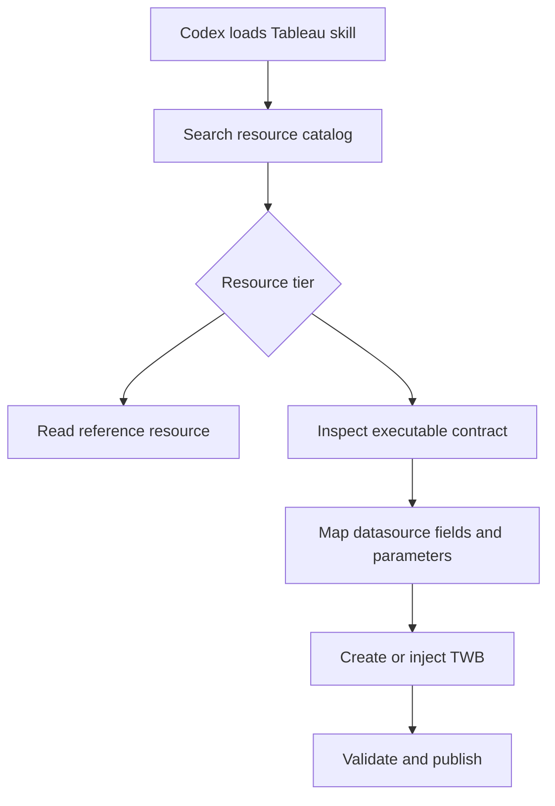

# Tableau Plugin Resources Design

## Goal

Make the Tableau samples, bookmark templates, XML examples, and reference
corpora discoverable to Codex and make a safe subset deterministically
executable against Tableau workbook files.

Codex will not depend on the Tableau Desktop external client API. It will
either download and modify an existing `.twb` or create one from a starter,
validate the resulting workbook package, and publish it through Tableau's
existing publish API.

## Architecture

The plugin will use a tiered hybrid model:

1. Every resource is indexed and available as reference material.
2. Templates that pass static portability checks are executable.
3. Templates with inline donor connections, unsupported calculations, viz
   extensions, or unresolved references remain inspiration-only.



The plugin manifest continues to expose `skills` and the hosted Tableau MCP
server. Codex plugin manifests do not provide a generic `data` discovery
surface, so skills are the entry points and a bundled CLI is the execution
surface.

## Package structure

```text
plugins/tableau/
  resources/
    catalog.json
    templates/
      executable/
      reference/
    examples/
    references/
    starters/
      minimal-workbook.twb
  scripts/
    tableau_resources.py
    generate_resource_catalog.py
  skills/
    tableau-workbook-authoring/
      SKILL.md
      references/
        resource-guide.md
    tableau-pulse-insights/
      SKILL.md
    validate-workbook-package/
      SKILL.md
```

The current `data/templates`, `data/examples`, and root JSON files will move
into the corresponding `resources` directories. The two upstream
`insights__bar_chart.tbm` and `insights__line_chart.tbm` bookmarks will be
added with recorded source provenance.

## Resource catalog

`resources/catalog.json` is generated, checked into the repository, and used
by both skills and scripts. It contains:

- Catalog schema version.
- Upstream repository, branch or tag, and source commit.
- Resource ID, type, family, intent, relative path, and keywords.
- `reference` or `executable` tier with classification reasons.
- Donor datasource names.
- Required and optional field slots, including datatype, role, derivation,
  shelf placement, and source field.
- Explicit template parameters such as `DATE_MIN`, `DATE_MAX`, and
  `DIRECTION`.
- Integrity hash for every source file.

The generator derives facts from file contents rather than template names
where possible. File names provide discovery keywords and intent, not runtime
field semantics.

## Discoverability

`tableau-workbook-authoring` is the main skill for creating, modifying, and
publishing `.twb` workbooks. It instructs Codex to:

1. Inspect or create the target workbook.
2. Search the resource catalog before hand-authoring a visualization.
3. Use reference resources for patterns and executable resources for
   deterministic generation.
4. Validate the resulting package before publishing.

`tableau-pulse-insights` is a focused entry point for Pulse Insights chart
requests. It filters the shared catalog to the two `insights__` resources and
then uses the same execution CLI. It does not duplicate templates or runtime
logic.

The existing validation skill remains the final pre-publish gate.

## Execution CLI

`scripts/tableau_resources.py` uses the Python standard library and exposes:

- `list`: search by text, family, resource type, or tier.
- `inspect`: print the selected resource's field and parameter contract.
- `instantiate`: create a workbook from the starter, a caller-supplied
  `<datasource>` definition, and one executable template.
- `inject`: add an executable template to an existing `.twb`.
- `validate`: check a generated `.twb` before package validation.

The CLI accepts explicit datasource, field, and parameter mappings. It never
guesses a field from its caption and never overwrites an input workbook unless
the caller supplies an explicit overwrite flag. Default behavior writes a new
output file.

For an existing workbook, the CLI reads available datasource and field
metadata from the `.twb`, verifies every required mapping, transforms the
bookmark into worksheet and window fragments, rewrites donor references, and
inserts the fragments without reserializing the rest of the workbook.

For a new workbook, the starter supplies a valid workbook shell.
`instantiate` requires `--datasource-definition <path>` containing exactly one
valid Tableau `<datasource>` element. The CLI inserts that element, reads its
fields for mapping validation, and will not fabricate connection metadata.

## Executable eligibility

A template is executable only when automated checks establish that it:

- Is a well-formed Tableau bookmark with one worksheet table and window.
- Uses one donor datasource whose references can be rewritten.
- Has complete column metadata for every placed field.
- Has no inline connection or embedded extract dependency.
- Has no unsupported viz extension.
- Has no calculation dependency outside the inferred field contract.
- Has no unresolved bare field reference after tokenization.
- Produces a well-formed worksheet/window pair in a golden fixture.

Passing these rules, rather than belonging to the lean naming cohort, grants
executable status. The large `family__chart__intent` bookmarks remain
reference-only unless they independently pass.

## Workbook transformation safety

The CLI parses XML to inspect and validate structure but uses bounded text
splices for insertion so it does not rewrite unrelated Tableau XML,
namespaces, formatting, or unknown elements.

Before writing output it verifies:

- The input is a Tableau workbook with worksheet and window containers.
- The target datasource exists.
- Every required source field and parameter has one mapping.
- The output worksheet name is unique or explicitly renamed.
- No `{{...}}`, `federated.XXXX`, or donor datasource references remain.
- Every datasource-qualified field reference resolves to the selected target
  datasource.
- The output is well-formed XML and the input file remains unchanged.

On failure, the CLI exits nonzero, reports the exact missing mapping or
structural condition, and does not create a partial output.

## Publish handoff

Publishing remains outside the resource CLI:

1. Codex creates or downloads a workspace and `.twb`.
2. The resource CLI modifies a copy.
3. The existing package-validation workflow validates the `.twbx` receipt.
4. Codex passes that receipt to Tableau's create-and-publish API.

This keeps resource execution deterministic and local while authentication,
packaging, and publishing remain owned by Tableau services.

## Testing

Tests will cover:

- Catalog generation, deterministic ordering, integrity hashes, and provenance.
- Classification reasons for executable and reference-only templates.
- Search and inspection output.
- Field, datasource, derivation, and parameter mapping validation.
- Golden output for a portable bar template and both Pulse Insights templates.
- Injection into an existing workbook without changing unrelated bytes.
- Starter workbook generation.
- Duplicate worksheet names, missing containers, malformed XML, unsupported
  templates, unresolved tokens, and incomplete mappings.
- Input preservation and no partial output on every failure path.
- Catalog drift detection so resource changes require regeneration.

## Out of scope

- Tableau Desktop or its external client API.
- Reimplementing the complete Tableau MCP bookmark compiler.
- Executing every large inline-datasource bookmark in the first release.
- Generating datasource connection metadata without caller input.
- Publishing directly from the resource CLI.

## Success criteria

1. Codex discovers the authoring and Pulse skills from this plugin.
2. A catalog query returns relevant samples and templates without scanning all
   resource files.
3. Codex can inspect any resource as inspiration.
4. Codex can create or inject each eligible template with explicit mappings.
5. Generated workbooks pass local structural validation and the existing
   package-validation workflow.
6. Reference-only templates fail closed with a clear classification reason.

